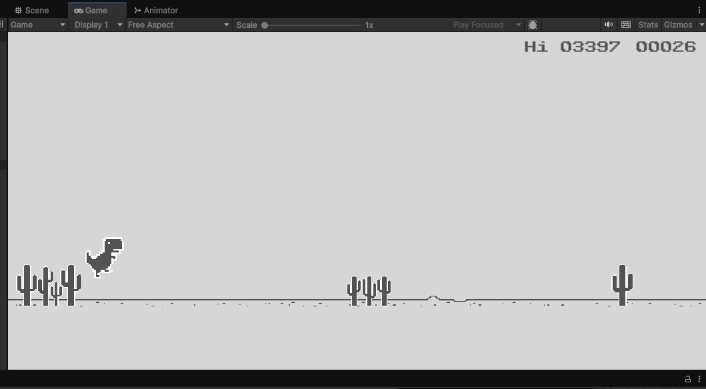

# Dino Game Clone (2D)

> Dino Game — это браузерная игра, разработанная Google и встроенная в веб-браузер Google Chrome. Игрок управляет пиксельным тираннозавром Рексом,
> который бежит по прокручивающемуся сбоку пейзажу, избегая препятствий, чтобы набрать как можно больше очков. Игра была создана участниками команды Chrome UX в 2014 году.

Темы: 
- Боковая прокрутка
- бесконечная генерация
- параллакс
- рекорды

Версия: Unity 6000.0.36f1 (LTS)
